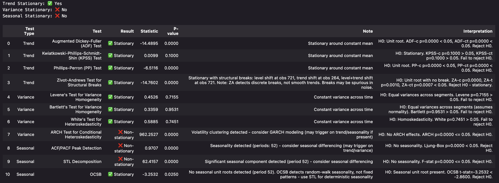

# Summary

Time-series stationarity is a property that statistical characteristics such as trend, variance, seasonality remain constant over time. It is considered fundamental to many forecasting and analysis methods. Different tests detect different types of non-stationarity: structural breaks or deterministic trends, clustered or time-dependent variance, stochastic or deterministic seasonality. A series might pass one test while failing another; single-test approaches seldom distinguish between conceptually different types of non-stationarity that require different types of tests and transformations.

`StationarityToolkit` addresses this by providing a comprehensive Python library that runs 10 statistical tests across three categories: trend (4 tests), variance (4 tests), and seasonality (2 tests). Rather than a binary stationary/non-stationary verdict, users receive detailed diagnostics with actionable notes for each detection. The toolkit automatically infers the frequency of the data provided (requires datetime index), provides clear interpretations with test statistics and p-values, and supports an iterative test-transform-retest workflow essential for real-world data sets.

# Statement of Need

Stationarity testing is one of the critical preprocessing steps for time series analysis, but it is not a single question with a single answer. Non-stationarity can manifest as unit roots, deterministic trends, structural breaks, variance instability, volatility clustering, or seasonal patterns - each requiring different transformations. Practitioners need to identify *which type* of non-stationarity exists to choose the right remedy: differencing for unit roots [@dickey1979unit], detrending for deterministic trends, Box-Cox [@box1964transformations] for variance instability, or seasonal differencing for periodic patterns.

This gap becomes particularly challenging when transformations interact unpredictably. Differencing to remove trend can introduce variance non-stationarity; variance stabilization can be undone by subsequent differencing. Without comprehensive testing after each transformation, practitioners cannot verify whether their preprocessing actually achieved stationarity or introduced new problems. An iterative test-transform-retest workflow is essential, but orchestrating this across multiple libraries and tests is tedious and error-prone. 

The target audience includes data scientists, econometricians, and researchers working with time series data who need to prepare data for different use cases including ARIMA/SARIMA models, VAR analysis, Granger causality tests, or machine learning applications where stationarity improves generalization. The toolkit is particularly valuable for practitioners who need to understand *what type* of non-stationarity exists in their data.

# State of the Field

Several Python packages address aspects of time series stationarity testing. The `statsmodels` library [@seabold2010statsmodels] provides individual unit root tests (ADF [@dickey1979unit], KPSS [@kwiatkowski1992kpss], Phillips-Perron [@phillips1988testing], Zivot-Andrews [@zivot1992further]) and seasonal decomposition (STL [@cleveland1990stl]). The `arch` package [@sheppard2017arch] offers unit root tests and ARCH/GARCH models [@engle1982arch] for volatility modeling, though its primary focus is on fitting volatility models rather than comprehensive stationarity diagnostics. The `scipy` library [@2020SciPy-NMeth] offers variance comparison tests (Levene [@levene1960robust], Bartlett [@bartlett1937properties]). The `pmdarima` library [@smith2017pmdarima] includes stationarity tests primarily as preprocessing for auto-ARIMA model selection rather than as standalone diagnostic tools. In all cases, users must manually run tests from different libraries, interpret potentially conflicting results, and determine which transformations to apply.

`StationarityToolkit` differs by integrating testing across all the stationarity dimensions - trend, variance, and seasonality - in a single call with a report that summarizes test outcome, actionable notes, caveats, and their statistical interpretation. It goes one step further to infer time-series frequency (requires datetime index) before testing for seasonal non-stationarity to maintain intuitiveness in its results. This approach also reveals test limitations in its notes (e.g., Zivot-Andrews detecting "breaks" in smooth trends, ARCH triggering on auto-correlation) that single-test approaches miss.

The design philosophy of the toolkit prioritizes transparency over prescription; the toolkit shows users what's happening in their data rather than making transformation decisions for them. This is because transformation effectiveness could vary unpredictably across datasets, and across use cases as demonstrated in the package documentation where identical transformations produce opposite variance outcomes on synthetic versus real data.

# Software Design

`StationarityToolkit` is implemented as a pure Python package with dependencies on `numpy` [@2020NumPy-Array], `pandas` [@mckinney2010pandas], `scipy` [@2020SciPy-NMeth], `arch` [@sheppard2017arch], and `statsmodels` [@seabold2010statsmodels]. The architecture separates test implementation (in `tests/` modules organized by trend, variance, and seasonality), result formatting and output generation (`results.py`), and the main detection entry point (`toolkit.py`). This design enables community contributions, reliably expanding the suite of tests while maintaining consistent user experience.

The toolkit evolved significantly from its initial design. Early versions (0.x) attempted to provide both testing and automated transformations with inverse functions, but this approach proved problematic as the effectiveness of transformations was found to vary unpredictably across datasets, and their needs vary by use case; this meant automated decisions obscured what was actually happening to the data. Version 1.x and the following 2.x represented a fundamental redesign, pivoting to a scaled-down pure diagnostic analysis tool with an expanded test suite grounded in statistical theory. This design choice - diagnostics over automation - was based on the reflection about the reality that practitioners need to understand their data's specific non-stationarity characteristics to make informed decisions for their use case.

Key design decisions include:

1. **Comprehensive testing by default**: Running all 10 tests in a single call eliminates the cognitive burden of deciding which tests to run and at the same time ensures users don't miss critical information that they would otherwise miss.

2. **Structured output with actionable notes**: Each test returns not just pass/fail but also concise notes on the test, its caveats and suggestions (e.g. "Unit root detected - requires differencing", "Deterministic trend detected - stationary after detrending").

3. **Contextual seasonality detection**: Seasonal tests automatically determine appropriate periods to test based on time series frequency (e.g. testing for weekly, monthly, and yearly seasonality in daily data), eliminating the need for manually specifying periods to test. This requires the time series to have datetime index.

4. **2-pronged reporting**: The `report()` method returns results as a pandas DataFrame and optionally writes a markdown report when a filepath is provided, supporting both interactive analysis and documentation.

5. **Intuitive trend tests**: All unit root tests (ADF [@dickey1979unit], KPSS [@kwiatkowski1992kpss], Phillips-Perron [@phillips1988testing]) run to test both constant-only and constant-plus-trend parameters, intuitively determining whether non-stationarity is due to unit roots or deterministic trends. 

The implementation prioritizes correctness and interpretability. Tests run sequentially and the typical execution time for all tests on a 1000-row series is under 2 seconds on modern hardware.

{width="100%"}

{width="100%"}

# Research Impact Statement

`StationarityToolkit` addresses a genuine gap in the Python ecosystem; while individual stationarity tests exist in various libraries, no tool provides comprehensive integrated testing across trend, variance, and seasonality dimensions with actionable notes. The package has been publicly available on PyPI since 2023.

The toolkit's research significance lies in its ability to reveal test limitations and cross-contamination effects (e.g. variance non-stationarity emerging as a result of differencing to allay trend non-stationarity) that single-test approaches miss. The comprehensive documentation, including validation on synthetic as well as real data (`examples/detailed_usage.ipynb`), provides researchers with a context for when and why different tests succeed or fail. This transparency is particularly valuable when reproducibility is important - where understanding *why* a transformation was chosen matters as much as the transformation itself.

The package demonstrates credible significance through its complete implementation of established statistical tests, clear documentation with reproducible examples, and active maintenance. It is designed for immediate integration into research workflows, with pandas DataFrame outputs that integrate seamlessly with existing analysis pipelines and markdown export for documentation.

# AI Usage Disclosure

The toolkit's core design, tests write-up, examples and this paper were all conceived and written by human author. The specific use of AI is as follows:

**Tool use**: Claude (Anthropic, versions 3.5 Sonnet and Opus 4) was used for refining code, docs.

**Nature and scope of assistance**: AI assisted with removing redundant code (written by human), changing variable names (for intuitiveness), adding doc-strings, and documentation (refining README and notebooks inside `examples/`). Also, the idea of using dataclass for `results.py` was assisted by AI with focus to improve the result synthesis for users.

**Confirmation of review**: All AI-generated content was reviewed, edited, and validated by the human author. Core design decisions were made by the human author based on domain expertise in time series analysis. Test implementations were validated against established libraries (`statsmodels`, `arch`, `scipy`) and on synthetic data with known properties. The human author takes full responsibility for the accuracy, correctness, and scientific validity of all submitted materials.

# References

